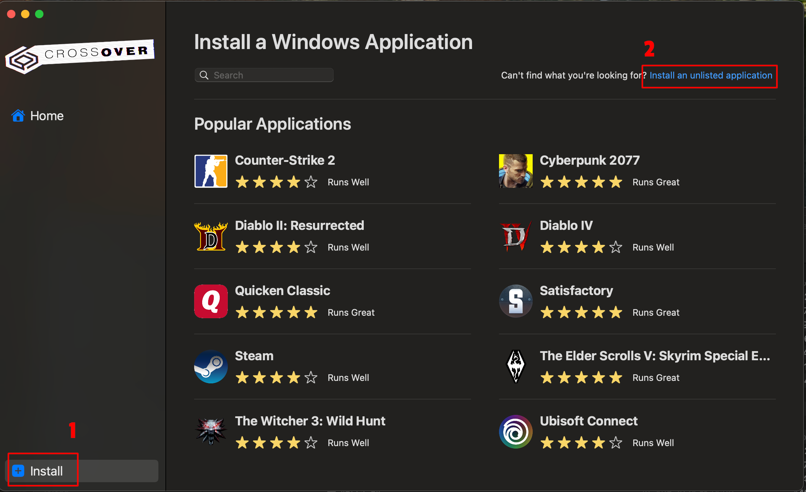
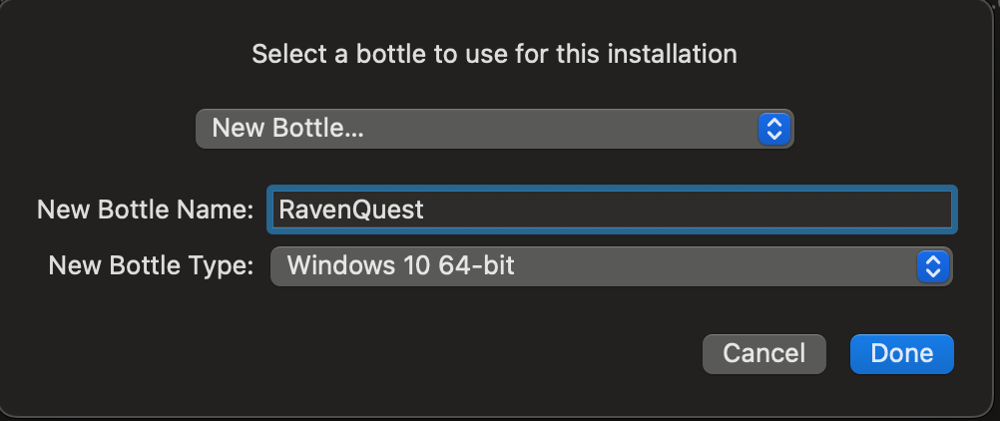
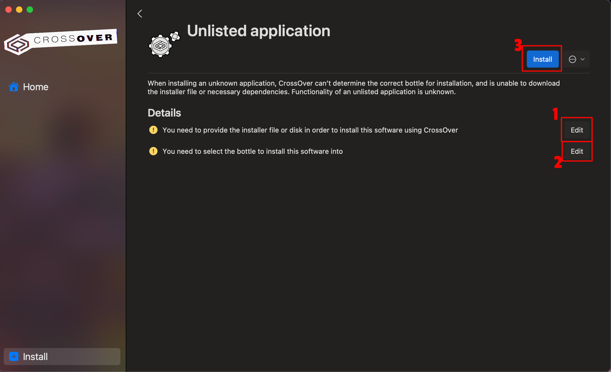
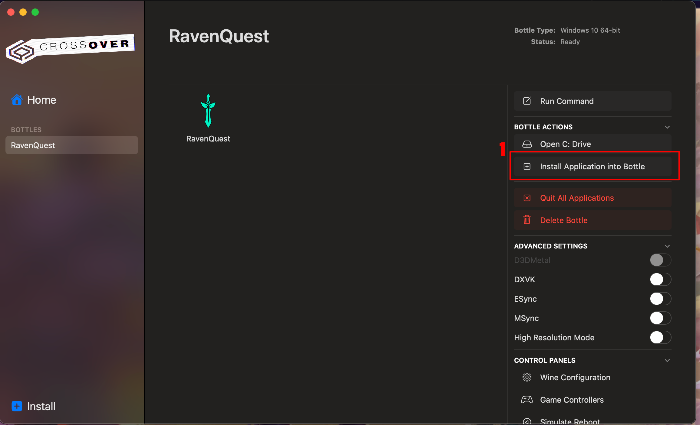
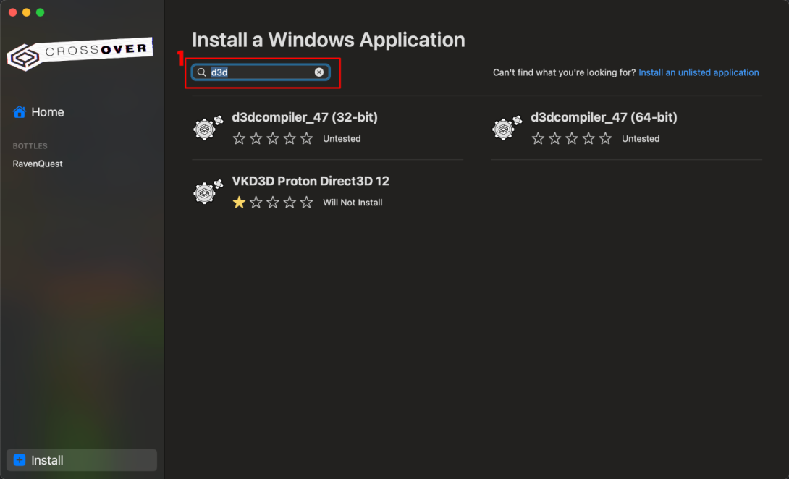
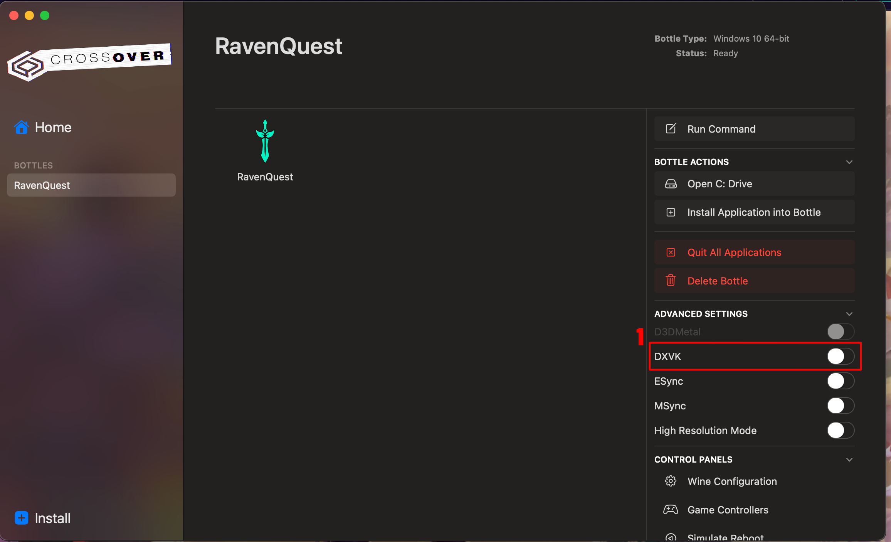

# How to play RavenQuest on macOS using CrossOver

*A guide written by Urdhi for the RavenQuest community :heart:*  
*1.0.1 2025-03-14*

***:bangbang: IMPORTANT NOTICE :bangbang:***

**Due to the implementation of BattlEye, playing on Mac or Linux using Wine/Proton is currently not possible due to compatibility issues!**
At this time, the game can only be played on Windows or within a virtual machine.
The team is actively working on a native Mac client (and hopefully one for Linux as well :heart:).

***:bangbang: IMPORTANT NOTICE :bangbang:***

# Table of Contents
1. [Prerequisites](#prerequisites)
2. [Creating a Bottle](#create-a-bottle)
3. [Installing RavenQuest](#installing-ravenquest)
4. [Adding missing Libraries](#adding-missing-libraries)
5. [Enabling DXVK](#enabling-dxvk)
6. [Troubleshooting](#troubleshooting)

## Prerequisites
Before getting started, make sure you meet these requirements:

1. **A Mac**:
  This guide was tested on a MacBook Pro 2019 with Intel Core i9 processor and macOS 15.1.
  It should also work on Macs with Apple Silicon, but players have reported freezes after 30–60 minutes of gameplay.
  Using CrossOver seems to improve stability on Apple Silicon devices.

2. **CrossOver**:
  You’ll need CrossOver to run Windows applications on your Mac.
  You can purchase and download it from the official website: [https://www.codeweavers.com/crossover](https://www.codeweavers.com/crossover).

3. **Internet Connection**:
  A stable connection is required to download CrossOver, game files, and libraries.

## Creating a Bottle
1. Open CrossOver and click `Install` in the left menu (1), then select `Install an unlisted application` at the top right (2).

2. In the pop-up, select `New Bottle...`, enter the name of your application (e.g. RavenQuest) and choose `Windows 10 64-bit` as the Bottle type.  
Click `Done` to create the Bottle.

## Installing RavenQuest

1. Download the game installer (EXE file) from the official website: [https://ravenquest.io](https://ravenquest.io).
2. In CrossOver, click `Edit` (1+2), and select your newly created Bottle (e.g. RavenQuest).
   Then, click `Install` (3).

3. Run the RavenQuest installer and configure it as needed.
   If you don’t uncheck *launch game* during installation, the game will immediately launch and crash.
   This is normal and not an issue.

## Adding missing Libraries
To resolve startup errors and shader issues (e.g. oddly colored characters), follow these steps:

1. Open the RavenQuest Bottle in CrossOver and click `Install Application into Bottle` (1).

2. In the search bar, type `d3d`.

3. **For both `d3dcompiler_47 (32-bit)` AND `d3dcompiler_47 (64-bit)`, do the following:**
  - Select the corresponding library.
  - Click `edit` and select your Bottle (e.g. RavenQuest).
  - Click `Install` to add the library.

## Enabling DXVK
DXVK improves performance, reduces power consumption and fixes graphical issues like a black world map. To enable it:

1. Open the RavenQuest Bottle in CrossOver.
2. Go to Advanced Settings and toggle the button to enable `DXVK` (1).

You’re all set! Click the RavenQuest tile in CrossOver to launch the game.

## Troubleshooting
If you experience performance issues or freezes:

Try enabling `ESync` or `MSync` (in every combination) under Advanced Settings.
Some players have reported improved stability with these options.

---

Visit my community page [https://ravenquest.de](https://ravenquest.de)

*I hope this guide helps you and makes it easy for you to enjoy this fantastic game on your Mac. :apple: :heart:  
If you have any questions, please feel free to contact me in the Discord!*

*Spread the word, but please mention me as the author!*
